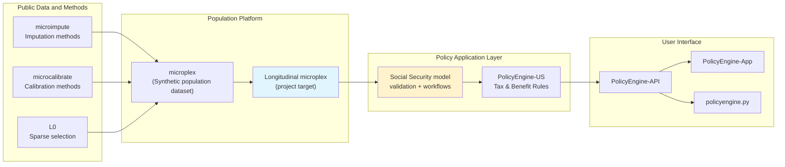

# Infrastructure and Tools

## Overview

Building a dynamic Social Security microsimulation model requires
infrastructure for data processing, synthesis, calibration, and policy
simulation. The most important architectural point is now clear:
`microplex` should be treated as the population platform and dataset,
while this repository provides the Social Security-specific application
layer on top of it. This chapter describes the tools that make that
split possible.

## PolicyEngine Ecosystem

Our model builds on PolicyEngine's existing open-source infrastructure:



The high-level logic is:

- use `microplex` as the public population asset
- extend `microplex` longitudinally
- use PolicyEngine-US and this repository to turn that asset into a
  Social Security policy model

This means the project should avoid rebuilding generic synthesis
machinery in the Social Security repository when that work properly
belongs in `microplex`.

## Population Platform Versus Application Layer

The tooling should be divided intentionally.

### What belongs in microplex

- synthetic public population construction
- cross-sectional and longitudinal calibration machinery
- generic earnings-trajectory methods
- household, person, and tax-unit coherence
- generic panel-evolution methods
- dataset-level validation of synthetic population quality

### What belongs in the Social Security repository

- OASDI, SSI, and tax-rule integration through PolicyEngine-US
- Social Security-specific target construction
- claiming, spouse, survivor, and disability application logic
- replication of published baseline and reform tables
- user-facing documentation and policy-analysis workflows

That separation makes the project more reusable and makes its
comparison to DYNASIM more honest. The relevant comparison is not a
single small repository against a mature institutional model. It is a
public population platform plus an open policy application layer.

## Key Tools and Libraries

### microplex: the core population platform

**Purpose**: public synthetic population dataset and synthesis platform

**Repository**: https://github.com/CosilicoAI/microplex

**Key Capabilities**:
- synthetic microdata generation
- multi-source fusion
- zero-inflation handling
- base-population calibration and sparse selection
- candidate longitudinal and trajectory tooling

**Our Use**:
- **base population platform for this project**
- host the longitudinal extension work that should outlive Social
  Security alone
- supply the public population asset consumed by the Social Security
  application layer

**Status**: active research and engineering platform; cross-sectional
capabilities are already substantial, while longitudinal capabilities
are the central next step

### microimpute: ML-Based Variable Imputation

**Purpose**: Impute missing variables using machine learning

**Repository**: https://github.com/PolicyEngine/microimpute

**Key Capabilities**:
- Random forest imputation
- Quantile regression forests
- Multiple imputation
- Cross-validation and validation
- Preserves correlations and distributions

**Our Use**:
- one important method family inside the broader `microplex`
  longitudinal build
- baseline earnings-history reconstruction
- imputation of latent variables (earnings potential, health)
- multiple imputations for uncertainty quantification

**Example Workflow**:
```python
from microimpute import QuantileRegressionForest

# Train model on PSID
qrf = QuantileRegressionForest(
    features=['age', 'education', 'current_earnings'],
    target='earnings_at_age_25'
)
qrf.fit(psid_data)

# Predict distribution for CPS
earnings_dist = qrf.predict_quantiles(
    cps_data,
    quantiles=[0.1, 0.25, 0.5, 0.75, 0.9]
)

# Sample from distribution
cps_data['earnings_25_imputed'] = qrf.sample(cps_data)
```

**Status**: Actively maintained, useful as a baseline method family even
if more ambitious synthesis methods are added to `microplex`

### microcalibrate: Base-Population Calibration

**Purpose**: Calibrate the base cross-sectional population to external
targets using gradient descent or related methods

**Repository**: https://github.com/PolicyEngine/microcalibrate

**Key Capabilities**:
- Base-population gradient calibration
- Multiple simultaneous targets
- Constraint satisfaction
- Convergence monitoring
- Performance optimization

**Our Use**:
- core calibration method for the base synthetic population layer
- match base-year earnings distributions to SSA and IRS data
- align base-year beneficiary counts to administrative totals
- prepare donor or source pools before longitudinalization
- diagnose which errors are weight-correctable versus process errors

After the longitudinal relationship network exists, calibration should
mostly operate through event selection, process intercepts, donor
probabilities, and network-preserving resampling. Year-by-year
individual reweighting would make spouse and parent-child links
incoherent.

**Example Workflow**:
```python
from microcalibrate import calibrate

# Define targets
targets = {
    'mean_earnings_age_25_male': 45000,
    'mean_earnings_age_25_female': 40000,
    'retired_beneficiaries_age_65': 12_200_000,
    # ... hundreds more targets
}

# Calibrate base-year representation before longitudinalization
representation_factors = calibrate(
    data=base_population,
    targets=targets,
    initial_weights=cps_weights,
    method='gradient_descent',
    tolerance=0.01,  # 1% tolerance
    max_iterations=1000
)

# Carry stable representation factors into the dynamic simulation
base_population['representation_factor'] = representation_factors
```

**Status**: Actively maintained and central for base-year population
construction. Dynamic alignment needs additional transition-control
machinery.

### L0: Sparse Selection and Base Calibration

**Purpose**: L0 regularization for discrete sample selection and sparse base-population calibration

**Repository**: https://github.com/PolicyEngine/L0

**Key Capabilities**:
- L0 regularized optimization
- Discrete (0/1) weight selection
- Gradient-based optimization
- Sample size reduction while maintaining targets

**Our Use**:
- **Optional**: Select representative subsample for computational efficiency
- Alternative to dense base-population reweighting
- Identify most informative observations
- Reduce computational burden for web app deployment

**Example Workflow**:
```python
from l0 import sparse_calibrate

# Select 50,000 most informative observations
selected_indices = sparse_calibrate(
    data=synthetic_panel,
    targets=targets,
    n_select=50_000,
    method='l0_gradient'
)

# Create reduced dataset
panel_subset = synthetic_panel[selected_indices]
```

**Status**: Under development, research stage

### PolicyEngine-US-Data: Enhanced CPS

**Purpose**: Construct high-quality microdata from CPS with improved income reporting

**Repository**: https://github.com/PolicyEngine/policyengine-us-data

The Enhanced CPS uses QRF imputation and gradient descent calibration to
~2,800 administrative targets [@ghenis2024]. That work is best
understood as an important precursor to `microplex`, not as the final
architecture of this project.

**Our Use**:
- historical foundation for the current public population layer
- proof that public-data enhancement and calibration can succeed at
  policy-relevant scale
- bridge between the older PolicyEngine data pipeline and `microplex`

**Extensions for Dynamic Model**:
- move from a calibrated cross-section to longitudinal `microplex`
- add earnings histories and transitions
- add longitudinal calibration and validation targets

### PolicyEngine-Core: Microsimulation Engine

**Purpose**: Core microsimulation framework (forked from OpenFisca-Core)

**Repository**: https://github.com/PolicyEngine/policyengine-core

**Key Capabilities**:
- Variable and parameter system
- Vectorized calculations
- Entity structure (person, household, tax unit)
- Time period handling
- Reform specification
- Extensive formula primitives

**Our Use**:
- **Calculation engine for Social Security benefits**
- Already implements OASDI rules
- Handles reform specifications
- Efficient vectorized simulation
- Proven reliability and accuracy

**Extension Needed**:
- Add variables for full earnings history
- Enhance longitudinal capabilities
- Support cohort-based analysis

## Additional Open-Source Tools

### Quantile Regression Forest (quantreg)

**Package**: `scikit-garden` or custom implementation

**Purpose**: Predict conditional quantiles for distributional imputation

**Use**: Core of earnings history imputation

### NumPy and Pandas

**Packages**: `numpy`, `pandas`

**Purpose**: Data manipulation and numerical computation

**Use**: Throughout data construction and analysis

### Statsmodels

**Package**: `statsmodels`

**Purpose**: Statistical modeling for hazard models and validation

**Use**:
- Discrete-time hazard models for transitions
- Logistic regression for event modeling
- Diagnostic tests and validation

### Matplotlib and Plotly

**Packages**: `matplotlib`, `plotly`

**Purpose**: Visualization

**Use**:
- Validation charts
- Documentation figures
- Web app visualizations

### Jupyter

**Package**: `jupyter`

**Purpose**: Interactive development and documentation

**Use**:
- Exploratory data analysis
- Documentation notebooks
- Validation reports

## Data Storage and Versioning

### HDF5 for Large Datasets

**Format**: HDF5 (Hierarchical Data Format)

**Purpose**: Efficient storage of large panel datasets

**Advantages**:
- Compressed storage
- Fast random access
- Partial reading (don't need to load entire dataset)
- Metadata support

**Structure** (aligned with the 4-table output schema defined in [Technical Specifications](technical-specifications.md#output-dataset-structure)):
```
synthetic_panel.h5
├── person/            # One row per individual (demographics, status)
├── earnings/          # One row per person-year (covered earnings, QC)
├── relationship/      # Family network (marriages, parent-child)
├── event/             # Life events (disability, death, claiming)
├── computed/          # Derived variables (AIME, PIA, eligibility)
└── representation/
    └── representation_factor
```

For distribution, CSV or Parquet files (one per table) provide maximum accessibility. For production analysis, HDF5 or a SQL database provides better query performance.

### Version Control

**Data Versioning**: Track versions of:
- Source data (CPS vintage, PSID release)
- Imputation models
- Calibration targets
- Final synthetic panel

**Code Versioning**: Git for all code

**Reproducibility**: Every analysis records:
- Code version
- Data version
- Parameter assumptions
- Random seeds (for imputation)

## Cloud Infrastructure

### Computing Requirements

**Development**:
- Local machines sufficient for prototyping
- ~32GB RAM recommended for full dataset

**Production**:
- Cloud compute for panel generation (CPU-intensive)
- Parallel processing across cores/instances
- GPU optional for deep learning extensions

### Deployment

**API**: Google Cloud Platform (existing PolicyEngine infrastructure)

**Web App**: Static hosting for frontend, API backend

**Data**: Cloud storage for synthetic panel versions

**Compute**: On-demand compute for panel regeneration

## Software Architecture

### Modular Design

Our codebase follows modular structure:

```
policyengine-us-data/
├── data/
│   ├── downloads/         # Raw data downloads
│   ├── inputs/           # Processed inputs
│   └── outputs/          # Generated datasets
├── imputation/
│   ├── earnings/         # Earnings history imputation
│   ├── demographics/     # Demographic transitions
│   └── validation/       # Validation code
├── calibration/
│   ├── targets/          # Calibration target definitions
│   ├── base_population/  # Base-year weight calibration
│   ├── alignment/        # Event and process controls
│   └── validation/       # Calibration and alignment validation
├── simulation/
│   ├── projection/       # Forward projection
│   ├── benefits/         # Benefit calculation
│   └── reforms/          # Reform specifications
└── tests/
    ├── unit/             # Unit tests
    ├── integration/      # Integration tests
    └── validation/       # Validation tests
```

### Integration Points

**With PolicyEngine-US**:
- Synthetic panel formatted as PolicyEngine dataset
- Compatible with existing variable definitions
- Uses same entity structure
- Benefit calculations via PolicyEngine variables

**With PolicyEngine-API**:
- API endpoints for dynamic analysis
- Cohort analysis capabilities
- Lifetime benefit calculations
- Reform comparison

**With PolicyEngine-App**:
- Web interface for model access
- Visualization of lifetime profiles
- Distributional analysis dashboards
- Reform analysis tools

## Development Workflow

### 1. Data Acquisition
```bash
# Download CPS
python scripts/download_cps.py --year 2024

# Download PSID
python scripts/download_psid.py --years 1968-2024

# Download administrative targets
python scripts/download_ssa_data.py
```

### 2. Model Training
```bash
# Train quantile regression forests on PSID
python imputation/earnings/train_qrf.py \
    --input data/inputs/psid.parquet \
    --output models/qrf_earnings.pkl
```

### 3. Imputation
```bash
# Impute earnings histories to CPS
python imputation/earnings/impute_history.py \
    --input data/inputs/cps_2024.parquet \
    --model models/qrf_earnings.pkl \
    --output data/outputs/cps_with_history.h5
```

### 4. Base Calibration and Dynamic Alignment
```bash
# Calibrate the base population before longitudinalization
python calibration/base_population/calibrate.py \
    --input data/outputs/cps_with_history.h5 \
    --targets calibration/targets/ssa_2024.yaml \
    --output data/outputs/synthetic_panel_2024.h5

# Align dynamic transitions without independently reweighting linked people
python calibration/alignment/select_events.py \
    --input data/outputs/synthetic_panel_2024.h5 \
    --targets calibration/targets/transition_controls.yaml \
    --output data/outputs/aligned_panel_2024.h5
```

### 5. Validation
```bash
# Run validation suite
python validation/validate_panel.py \
    --input data/outputs/synthetic_panel_2024.h5 \
    --report reports/validation_2024.html
```

### 6. Deployment
```bash
# Package for PolicyEngine
python deployment/package_for_policyengine.py \
    --input data/outputs/synthetic_panel_2024.h5 \
    --output policyengine_us_data/datasets/ss_panel_2024/
```

## Testing Strategy

### Unit Tests

**Imputation**:
- QRF prediction accuracy on held-out PSID sample
- Quantile coverage tests
- Distribution preservation

**Calibration**:
- Target matching within tolerance
- Weight positivity
- Convergence

**Calculation**:
- Social Security benefit formulas
- Edge cases (minimum/maximum benefits)
- Spousal/survivor benefits

### Integration Tests

**End-to-End**:
- Full pipeline from raw CPS to synthetic panel
- Validation against all benchmarks
- Reproducibility (same inputs → same outputs)

### Validation Tests

**External Benchmarks**:
- Match SSA aggregates
- Compare to published DynaSim results
- Validate earnings distributions

### Performance Tests

**Computational**:
- Panel generation time
- Memory usage
- API response times

**Accuracy**:
- Prediction intervals for benefits
- Uncertainty quantification
- Sensitivity analysis

## Documentation Strategy

### Technical Documentation

**Code Documentation**:
- Docstrings for all functions
- Type hints
- Inline comments for complex logic

**Architecture Documentation**:
- System design documents
- Data flow diagrams
- API specifications

### User Documentation

**Web Documentation**:
- Getting started guide
- Methodology documentation
- API reference
- Examples and tutorials

**Academic Documentation**:
- Technical papers
- Validation reports
- Comparison to other models

### Quarto Book

Like this document:
- Planning and methodology
- Validation and results
- Policy applications

## Open-Source Community

### Contributing Guidelines

**Code Contributions**:
- Issue reporting
- Pull request process
- Code review standards
- Testing requirements

**Data Contributions**:
- Alternative imputation methods
- Additional validation benchmarks
- New calibration targets

**Documentation**:
- Tutorials and examples
- Translation
- Improvements and clarifications

### Governance

**Development**:
- PolicyEngine team leads development
- Community input via issues and PRs
- Regular releases with semantic versioning

**Quality**:
- Comprehensive testing
- Code review
- Continuous integration

**Transparency**:
- Public roadmap
- Open development process
- Community feedback

## Summary

We leverage a rich ecosystem of open-source tools:

**Core Tools** (PolicyEngine-developed):
- `microimpute`: ML imputation (QRF)
- `microcalibrate`: Gradient descent calibration
- `policyengine-us-data`: Enhanced CPS construction
- `policyengine-core`: Microsimulation engine

**Foundation** (Existing):
- Enhanced CPS as starting point
- Proven data construction pipeline
- Social Security rules already implemented
- Infrastructure for web/API deployment

**Additional Methodological Approaches** (To evaluate during proof of concept):
- **Zero-inflated quantile deep neural networks (ZI-QDNN)**: Primary candidate for earnings imputation, with dedicated zero-inflation head and conditional quantile output; early experiments show 3× better trajectory coverage than recurrent alternatives on survey panel data
- **Normalizing flows**: Conditional Masked Autoregressive Flows (MAF) as alternative for joint multi-year imputation, particularly where cross-year correlation structure matters
- **Multi-survey fusion**: Harmonize CPS, PSID, and PUF into unified datasets using common variable schemas and masked imputation for cross-survey variables
- **Sparse calibration**: IPF (raking), entropy balancing, and L0/L1/L2 sparse reweighting for base-population and donor-pool calibration, with network-preserving selection once relationships exist
- **Demographic transition models**: Discrete-time hazard models for disability onset/recovery (using SSA DI incidence rates), mortality (using SSA period life tables), and marriage/divorce (using CPS/ACS-based rates)
- **Hierarchical household synthesis**: Two-pass household/person generation preserving family structure, tax unit composition, and spousal earnings correlations

**Extensions** (To develop):
- Full earnings history imputation (ZI-QDNN primary, with QRF and normalizing flows as alternatives)
- Spousal matching and assortative mating
- Forward projection with multi-year calibration
- Dynamic analysis API and web interface

This infrastructure foundation accelerates development while ensuring quality, reproducibility, and accessibility.

The next chapter describes the team expertise that will execute this plan.
