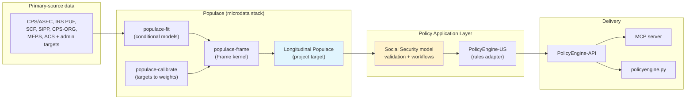

# Infrastructure and Tools

## Overview

Building a dynamic Social Security microsimulation model requires
infrastructure for data processing, synthesis, calibration, and policy
simulation. The most important architectural point is now clear:
`populace` should be treated as the population platform and dataset,
while this repository provides the Social Security-specific application
layer on top of it. This chapter describes the tools that make that
split possible.

## PolicyEngine ecosystem

The model builds on PolicyEngine's existing open-source
infrastructure:



The high-level logic is:

- `populace` builds and calibrates the public cross-sectional
  population from primary-source data (shipped; now the certified
  default U.S. microdata in policyengine.py)
- extend `populace` longitudinally — the project's central work
- use PolicyEngine-US and this repository to turn that asset into a
  Social Security policy model

This means the project should avoid rebuilding generic synthesis
machinery in the Social Security repository when that work properly
belongs in `populace`.

## Population layer versus application layer

The tooling should be divided intentionally.

### What belongs in Populace

- synthetic public population construction
- cross-sectional and longitudinal calibration machinery
- generic earnings-trajectory methods
- household, person, and tax-unit coherence
- generic panel-evolution methods
- dataset-level validation of synthetic population quality

### What belongs in the Social Security repository

- OASDI, SSI, and tax-rule integration through PolicyEngine-US
- Social Security-specific target construction
- claiming, spouse, survivor, and disability application logic
- replication of published baseline and reform tables
- user-facing documentation and policy-analysis workflows

That separation makes the project more reusable and makes its
comparison to DYNASIM more honest. The relevant comparison is not a
single small repository against a mature institutional model. It is a
public population platform plus an open policy application layer.

## Key tools and libraries

### Populace: the microdata stack

**Purpose**: build and calibrate the public population from
primary-source government data, and expose it to a rules engine.

**Status**: PolicyEngine's rebuilt open-source microdata stack
([github.com/PolicyEngine/populace](https://github.com/PolicyEngine/populace),
MIT). Built entirely from primary sources (CPS/ASEC, IRS PUF, SCF,
SIPP, CPS-ORG, MEPS, ACS), it replaced PolicyEngine's enhanced CPS as
the certified default U.S. microdata in policyengine.py in June 2026,
after beating it on a held-out, symmetric-refit comparison. Its
synthesis method (the `populace-fit` shard) is a regime-gated,
sequentially-chained, weight-aware quantile-regression-forest
imputer, with a gradient-boosted classifier handling zero inflation.

**Architecture**: one kernel datatype — the `Frame`, a weighted
sampling frame of entity tables — with operators as separate shards
that share the `populace.*` namespace:

- `populace-frame`: the kernel (typed weights with conservation
  invariants, strata for provenance, links, unit structure, and the
  rules-engine adapter protocol — policyengine-us today, Axiom's
  rules layer next). Succeeds microdf and microunit.
- `populace-fit`: weight-aware conditional models for synthesis and
  imputation. Succeeds microimpute.
- `populace-calibrate`: targets-to-weights calibration (accelerated
  projected gradient and L0 sparse selection). Succeeds
  microcalibrate.
- `populace-data` / `populace-build`: dataset registry and the
  gated, no-fallback build pipeline.

**Longitudinal status**: the kernel is longitudinal-ready by
design — one weight per trajectory — and Populace's charter names the
longitudinal extension (person-period keying, cohort entry and exit,
household recomposition over time) explicitly as "the
social-security-model direction." Those kernel hooks are deliberate
future work, and growing them is the central next step for this
project.

**Our use**:
- **base population layer for this project**
- host the longitudinal extension work that should outlive Social
  Security alone
- supply the public population asset consumed by the Social Security
  application layer

### Predecessor tooling: microimpute, microcalibrate, L0

Before Populace, PolicyEngine's enhancement pipeline used three
standalone packages: `microimpute` (quantile-regression-forest and
related imputation), `microcalibrate` (gradient-descent base-population
calibration), and `L0` (L0-regularized sparse record selection).
Populace reimplements their capabilities as the `populace-fit` and
`populace-calibrate` shards on the shared `Frame` kernel; the legacy
packages remain available but are no longer the path this project
builds on.

### Enhanced CPS: precursor work

PolicyEngine's earlier Enhanced CPS used QRF imputation and gradient
descent calibration against administrative targets [@ghenis2024].
That work is best understood as an important precursor to
`populace`, not as the architecture of this project. Populace
generalizes the conceptual approach into a broader ML-first
microdata stack.

### PolicyEngine-Core: Microsimulation Engine

**Purpose**: Core microsimulation framework (forked from OpenFisca-Core)

**Repository**: https://github.com/PolicyEngine/policyengine-core

**Key Capabilities**:
- Variable and parameter system
- Vectorized calculations
- Entity structure (person, household, tax unit)
- Time period handling
- Reform specification
- Extensive formula primitives

**Our Use**:
- **Calculation engine for Social Security benefits**
- Already implements OASDI rules
- Handles reform specifications
- Efficient vectorized simulation
- Proven reliability and accuracy

**Extension Needed**:
- Add variables for full earnings history
- Enhance longitudinal capabilities
- Support cohort-based analysis

## Additional Open-Source Tools

### Quantile Regression Forest (quantreg)

**Package**: `scikit-garden` or custom implementation

**Purpose**: Predict conditional quantiles for distributional imputation

**Use**: Core of earnings history imputation

### NumPy and Pandas

**Packages**: `numpy`, `pandas`

**Purpose**: Data manipulation and numerical computation

**Use**: Throughout data construction and analysis

### Statsmodels

**Package**: `statsmodels`

**Purpose**: Statistical modeling for hazard models and validation

**Use**:
- Discrete-time hazard models for transitions
- Logistic regression for event modeling
- Diagnostic tests and validation

### Matplotlib and Plotly

**Packages**: `matplotlib`, `plotly`

**Purpose**: Visualization

**Use**:
- Validation charts
- Documentation figures
- Web app visualizations

### Jupyter

**Package**: `jupyter`

**Purpose**: Interactive development and documentation

**Use**:
- Exploratory data analysis
- Documentation notebooks
- Validation reports

## Data Storage and Versioning

### HDF5 for Large Datasets

**Format**: HDF5 (Hierarchical Data Format)

**Purpose**: Efficient storage of large panel datasets

**Advantages**:
- Compressed storage
- Fast random access
- Partial reading (don't need to load entire dataset)
- Metadata support

**Structure** (aligned with the 4-table output schema defined in [Technical Specifications](technical-specifications.md#output-dataset-structure)):
```
synthetic_panel.h5
├── person/            # One row per individual (demographics, status)
├── earnings/          # One row per person-year (covered earnings, QC)
├── relationship/      # Family network (marriages, parent-child)
├── event/             # Life events (disability, death, claiming)
├── computed/          # Derived variables (AIME, PIA, eligibility)
└── representation/
    └── representation_factor
```

For distribution, CSV or Parquet files (one per table) provide maximum accessibility. For production analysis, HDF5 or a SQL database provides better query performance.

### Version Control

**Data Versioning**: Track versions of:
- Source data (CPS vintage, PSID release)
- Imputation models
- Calibration targets
- Final synthetic panel

**Code Versioning**: Git for all code

**Reproducibility**: Every analysis records:
- Code version
- Data version
- Parameter assumptions
- Random seeds (for imputation)

## Cloud Infrastructure

### Computing Requirements

**Development**:
- Local machines sufficient for prototyping
- ~32GB RAM recommended for full dataset

**Production**:
- Cloud compute for panel generation (CPU-intensive)
- Parallel processing across cores/instances
- GPU optional for deep learning extensions

### Deployment

**API**: Google Cloud Platform (existing PolicyEngine infrastructure)

**Web App**: Static hosting for frontend, API backend

**Data**: Cloud storage for synthetic panel versions

**Compute**: On-demand compute for panel regeneration

## Software Architecture

### Modular Design

Our codebase follows modular structure:

```
policyengine-us-data/
├── data/
│   ├── downloads/         # Raw data downloads
│   ├── inputs/           # Processed inputs
│   └── outputs/          # Generated datasets
├── imputation/
│   ├── earnings/         # Earnings history imputation
│   ├── demographics/     # Demographic transitions
│   └── validation/       # Validation code
├── calibration/
│   ├── targets/          # Calibration target definitions
│   ├── base_population/  # Base-year weight calibration
│   ├── alignment/        # Event and process controls
│   └── validation/       # Calibration and alignment validation
├── simulation/
│   ├── projection/       # Forward projection
│   ├── benefits/         # Benefit calculation
│   └── reforms/          # Reform specifications
└── tests/
    ├── unit/             # Unit tests
    ├── integration/      # Integration tests
    └── validation/       # Validation tests
```

### Integration Points

**With PolicyEngine-US**:
- Synthetic panel formatted as PolicyEngine dataset
- Compatible with existing variable definitions
- Uses same entity structure
- Benefit calculations via PolicyEngine variables

**With PolicyEngine-API**:
- API endpoints for dynamic analysis
- Cohort analysis capabilities
- Lifetime benefit calculations
- Reform comparison

**With PolicyEngine-App**:
- Web interface for model access
- Visualization of lifetime profiles
- Distributional analysis dashboards
- Reform analysis tools

## Development Workflow

### 1. Data Acquisition
```bash
# Download CPS
python scripts/download_cps.py --year 2024

# Download PSID
python scripts/download_psid.py --years 1968-2024

# Download administrative targets
python scripts/download_ssa_data.py
```

### 2. Model Training
```bash
# Train quantile regression forests on PSID
python imputation/earnings/train_qrf.py \
    --input data/inputs/psid.parquet \
    --output models/qrf_earnings.pkl
```

### 3. Imputation
```bash
# Impute earnings histories to CPS
python imputation/earnings/impute_history.py \
    --input data/inputs/cps_2024.parquet \
    --model models/qrf_earnings.pkl \
    --output data/outputs/cps_with_history.h5
```

### 4. Base Calibration and Dynamic Alignment
```bash
# Calibrate the base population before longitudinalization
python calibration/base_population/calibrate.py \
    --input data/outputs/cps_with_history.h5 \
    --targets calibration/targets/ssa_2024.yaml \
    --output data/outputs/synthetic_panel_2024.h5

# Align dynamic transitions without independently reweighting linked people
python calibration/alignment/select_events.py \
    --input data/outputs/synthetic_panel_2024.h5 \
    --targets calibration/targets/transition_controls.yaml \
    --output data/outputs/aligned_panel_2024.h5
```

### 5. Validation
```bash
# Run validation suite
python validation/validate_panel.py \
    --input data/outputs/synthetic_panel_2024.h5 \
    --report reports/validation_2024.html
```

### 6. Deployment
```bash
# Package for PolicyEngine
python deployment/package_for_policyengine.py \
    --input data/outputs/synthetic_panel_2024.h5 \
    --output policyengine_us_data/datasets/ss_panel_2024/
```

## Testing Strategy

### Unit Tests

**Imputation**:
- QRF prediction accuracy on held-out PSID sample
- Quantile coverage tests
- Distribution preservation

**Calibration**:
- Target matching within tolerance
- Weight positivity
- Convergence

**Calculation**:
- Social Security benefit formulas
- Edge cases (minimum/maximum benefits)
- Spousal/survivor benefits

### Integration Tests

**End-to-End**:
- Full pipeline from raw CPS to synthetic panel
- Validation against all benchmarks
- Reproducibility (same inputs → same outputs)

### Validation Tests

**External Benchmarks**:
- Match SSA aggregates
- Compare to published DynaSim results
- Validate earnings distributions

### Performance Tests

**Computational**:
- Panel generation time
- Memory usage
- API response times

**Accuracy**:
- Prediction intervals for benefits
- Uncertainty quantification
- Sensitivity analysis

## Documentation Strategy

### Technical Documentation

**Code Documentation**:
- Docstrings for all functions
- Type hints
- Inline comments for complex logic

**Architecture Documentation**:
- System design documents
- Data flow diagrams
- API specifications

### User Documentation

**Web Documentation**:
- Getting started guide
- Methodology documentation
- API reference
- Examples and tutorials

**Academic Documentation**:
- Technical papers
- Validation reports
- Comparison to other models

### Quarto Book

Like this document:
- Planning and methodology
- Validation and results
- Policy applications

## Open-Source Community

### Contributing Guidelines

**Code Contributions**:
- Issue reporting
- Pull request process
- Code review standards
- Testing requirements

**Data Contributions**:
- Alternative imputation methods
- Additional validation benchmarks
- New calibration targets

**Documentation**:
- Tutorials and examples
- Translation
- Improvements and clarifications

### Governance

**Development**:
- PolicyEngine team leads development
- Community input via issues and PRs
- Regular releases with semantic versioning

**Quality**:
- Comprehensive testing
- Code review
- Continuous integration

**Transparency**:
- Public roadmap
- Open development process
- Community feedback

## Summary

We leverage a rich ecosystem of open-source tools:

**Core tools** (PolicyEngine-developed):
- `populace`: the microdata stack (`populace-frame` kernel,
  `populace-fit` synthesis, `populace-calibrate` calibration)
- `policyengine-core`: microsimulation engine

**Foundation** (existing):
- `populace` as starting point — shipped, and the certified default
  U.S. microdata in policyengine.py
- proven data construction and calibration pipeline
- Social Security rules already implemented in PolicyEngine-US
- infrastructure for web/API deployment

**Additional methodological approaches** (to evaluate during proof of concept):
- **Baseline (incumbent)**: Populace's production synthesis method is a regime-gated, weight-aware quantile-regression-forest imputer. It is the proven cross-sectional method and the natural baseline for the longitudinal extension to beat.
- **Zero-inflated neural distribution models (e.g. ZI-QDNN)**: candidate for richer earnings-trajectory imputation, with a dedicated zero-inflation head and conditional quantile output — to evaluate against the QRF baseline, not assumed superior.
- **Normalizing flows**: candidate for joint multi-year imputation where cross-year correlation structure matters; to evaluate, not committed.
- **Multi-survey fusion**: Harmonize CPS, PSID, and PUF into unified datasets using common variable schemas and masked imputation for cross-survey variables
- **Sparse calibration**: IPF (raking), entropy balancing, and L0/L1/L2 sparse reweighting for base-population and donor-pool calibration, with network-preserving selection once relationships exist
- **Demographic transition models**: Discrete-time hazard models for disability onset/recovery (using SSA DI incidence rates), mortality (using SSA period life tables), and marriage/divorce (using CPS/ACS-based rates)
- **Hierarchical household synthesis**: Two-pass household/person generation preserving family structure, tax unit composition, and spousal earnings correlations

**Extensions** (To develop):
- Full earnings history imputation (regime-gated QRF baseline, with zero-inflated neural and flow models as candidates to evaluate)
- Spousal matching and assortative mating
- Forward projection with multi-year calibration
- Dynamic analysis API and web interface

This infrastructure foundation accelerates development while ensuring quality, reproducibility, and accessibility.

The next chapter describes the team expertise that will execute this plan.
