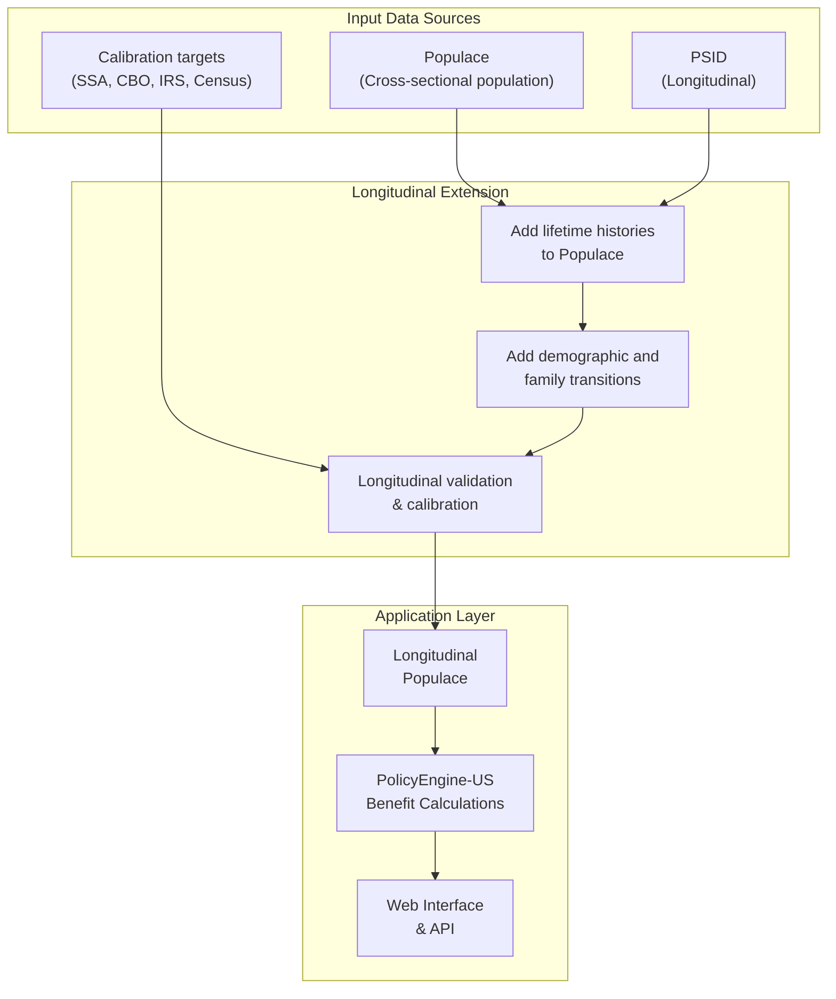

# Methodology

## Overview

This chapter describes the technical approach to making `populace`
longitudinal and then using that longitudinal population for Social
Security microsimulation. `populace` is PolicyEngine's rebuilt
open-source microdata stack: it synthesizes populations from
primary-source U.S. government survey and administrative data
(CPS/ASEC, IRS Public Use File, SCF, SIPP, CPS-ORG, MEPS, ACS) using
weight-aware machine-learning conditional models, and calibrates them
against administrative targets (CBO, IRS, SSA, Census, and others)
treated as uncertainty-weighted facts. The core challenge this
project adds is creating realistic lifetime earnings trajectories and
demographic transitions while maintaining cross-sectional accuracy,
longitudinal realism, and computational feasibility. The scope of
claims this machinery supports is bounded in
[domains-of-validity.md](domains-of-validity.md); its credential is
the scorecard defined in
[scoring-and-resolution.md](scoring-and-resolution.md).

The chapter below stays at the architecture level. The next chapter,
[operationalizing-longitudinal-construction.md](operationalizing-longitudinal-construction.md),
spells out the proposed lifetime-earnings build in much more concrete
terms, including how it compares component by component with DYNASIM,
MINT, and the public CBO record.

## Methodology flow

The following diagram illustrates the high-level data flow through the
synthetic panel construction process. `populace` draws on
primary-source microdata and administrative calibration targets
(including SSA aggregates):

## Conceptual framework

The methodology now has two explicit layers:

1. **Population layer**: make `populace` into a credible longitudinal
   synthetic population.
2. **Application layer**: use that longitudinal population for Social
   Security benefit calculation, validation, and reform analysis.

That split is not just organizational. It determines where methods and
code should live.

- Generic synthesis, calibration, trajectory construction, and
  longitudinal state machinery belong in `populace` or its companion
  packages.
- Social Security-specific logic, policy validation, and reform
  workflows belong in this repository and in PolicyEngine-US.

Within the population layer, the project should remain baseline-first.
That means the first implementation inside longitudinal `populace`
should use methods that are simple enough to audit and validate
directly. More ambitious joint generative models can be added later if
they improve the metrics that matter.

The fundamental design choice is therefore an annual state engine, not
a one-time earnings-history imputer. CBOLT and DYNASIM both point in
that direction: the model must carry person-year states, preserve
family links, select annual transitions, align to external controls,
and then calculate benefits from the resulting histories
[@cbo2018; @cbo2019replacementrates; @favreault2015; @urban2024dynasim4].
Machine learning is useful inside that system, but it is not the
system.

This produces a longitudinal public population with:
- representative synthetic records from the `populace` base population
- lifetime dynamics learned from panel data and external targets
- explicit calibration and validation artifacts
- reuse across Social Security and adjacent policy domains

### How this differs from existing models

**vs. DynaSim**: the comparison object is not this repository alone. It
is longitudinal `populace` plus PolicyEngine-US plus this Social
Security application layer. The differentiator is openness,
inspectability, and modularity rather than institutional continuity.

**vs. MINT**: We construct fully synthetic panel (vs. matched administrative data). Trade-off: MINT has actual earnings for older cohorts, but isn't publicly replicable. Our approach sacrifices that accuracy for full transparency.

**vs. CBOLT**: CBOLT already has individual-level microsimulation,
administrative earnings histories, family links, and official
macro-fiscal integration. The difference is not that this project has
microdata and CBOLT does not. The difference is that this project aims
to make the construction, validation, and policy workflow publicly
inspectable.

See the [Existing Models](existing-models.md) chapter for the broader
comparison to DynaSim, MINT, CBOLT, and other models.

## Phase 1: Base-year cross-section

### Starting point: Populace's current cross-sectional layer

The project starts from `populace`, PolicyEngine's rebuilt microdata
stack. Populace builds a calibrated cross-sectional population
entirely from primary sources and, in June 2026, replaced
PolicyEngine's enhanced CPS as the certified default U.S. microdata
in policyengine.py — after beating it on a held-out, symmetric-refit
comparison. The cross-sectional foundation has therefore already
shipped and won; the longitudinal extension is the open work.

Advantages of this starting point:

1. **Proven methodology**: Populace has already solved the
   cross-sectional income underreporting problem using the same
   tools the longitudinal extension will apply
2. **Integration**: seamless connection to PolicyEngine-US's
   existing tax-benefit calculations
3. **Asset value**: improvements made for this project strengthen
   `populace` rather than remaining trapped in a narrow application
   repository
4. **Credibility**: builds on a demonstrated production stack rather
   than restarting from scratch
5. **Sample size**: a large synthetic public population provides
   statistical power for national and subnational analysis

Populace improves upon raw CPS through:

**Income imputation**: filling missing income components with
weight-aware conditional models (the `populace-fit` shard, succeeding
`microimpute` — quantile regression forests and related methods)

**Benefit underreporting correction**: aligning survey-reported
transfer income with administrative aggregates

**Tax unit construction**: creating tax filing units from household
structure

**Multi-source calibration**: base-population reweighting (the
`populace-calibrate` shard) against administrative aggregates from
CBO, IRS, SSA, Census, and other sources

The proof-of-concept phase should validate that `populace` can be
extended longitudinally, rather than reopening the question of
whether the project should start from some entirely different base
population. If computational constraints arise with the full
synthetic population, sparse selection techniques can still be used
for research and product deployment while preserving the underlying
population asset.

### Adding historical variables

For dynamic modeling, we need variables not in CPS:

**Education**: Already in CPS, but we validate and impute where missing

**Occupation and industry**: For earnings trajectory modeling

**Health and disability**: Impute from HRS and NHIS using statistical matching

**Potential variables**: Predict latent variables that govern dynamics:
- Earnings potential (distinct from current earnings)
- Health status (not just disability)
- Labor force attachment

These "latent" variables will drive longitudinal transitions even when not directly observed.

## Phase 2: Longitudinal extension of Populace

### The core challenge

Social Security benefits depend on 35 highest years of earnings, but the
current public population layer only observes a cross-section. We need
to extend `populace` so that it carries:

- Past earnings for current workers (ages 18-70)
- Future earnings for younger workers (for projections)
- Full lifetime profiles that respect:
  - Age-earnings life cycle
  - Earnings mobility (but not too much)
  - Educational differentials
- Cohort effects
- Realistic variance

This is the step where the project becomes more than a static synthetic
dataset. It turns `populace` into a longitudinal population asset.

### Earnings-history approach inside longitudinal Populace

The project should begin with a benchmark set rather than prematurely
declaring one model family to be the production architecture. The
current `populace` direction points away from plain sequential QRF as
the main design and toward zero-inflated, pathwise generation inside
`populace`.

That means the proposal should distinguish:

- **diagnostic comparators** such as QRF and ZI-QRF
- **serious production candidates** such as ZI-QDNN and zero-inflated
  pathwise `populace` models
- **the architectural question underneath them**: sequential age-point
  imputation versus all-at-once trajectory generation

The methodological objective is therefore not "use QRF because it is
familiar." It is "use the simplest architecture that survives the
Social-Security-specific validation gates." The refreshed `populace`
imputation evaluations should help decide whether the leading candidate
is ZI-QDNN, a flow-based pathwise model, or another zero-inflated
trajectory approach. The proposal should be written to accommodate that
decision rather than forcing it in advance.

**Training data**: PSID (1968-present)

**Features** (X variables):
- Current earnings
- Age
- Sex
- Race/ethnicity
- Education
- Marital status
- Number of children
- Occupation
- Industry
- State
- Year (cohort effects)

**Target** (Y variables):
- Earnings at age 25, 30, 35, ..., 65 for age-point benchmark models
- Earnings growth rates over 5-year periods
- Career patterns including years with zero earnings
- Full age-path earnings vectors for all-at-once trajectory models

**Phase-1 comparison approach**:

For each base-year CPS or `populace` individual, the project should
compare at least two families:

1. **Age-point benchmark models**:
   predict earnings or earnings quantiles at a set of ages, then stitch
   those points into a path
2. **All-at-once trajectory models**:
   generate the full earnings path as one conditional object, with
   zero-inflation handled explicitly

The first family is useful because it is interpretable and easy to
debug. The second is the more likely production direction because it is
better aligned with the actual `populace` longitudinal architecture and
preserves cross-age dependence natively.

### Interval-specific training strategy for benchmark models

Rather than training one model for all ages, we train separate
comparator models for each age:

**Model 25**: Predict earnings at age 25 | features at age 25+

**Model 30**: Predict earnings at age 30 | features at age 30+

...

**Model 65**: Predict earnings at age 65 | features at age 65+

This approach:
- Captures age-specific patterns
- Allows different predictors to matter at different ages
- Prevents impossible trajectories (e.g., starting at $200k at age 22)
- Provides an interpretable benchmark arm for the more ambitious
  `populace` trajectory models

But it should no longer be described as the expected production
architecture.

### Expected production direction: joint trajectory synthesis

The stronger architectural bet is that `populace` should learn full
earnings trajectories all at once, with zero-inflation built directly
into the model. In practice, that means:

- conditioning on demographic and cohort features from the base
  cross-section
- generating `P(earnings_18:70 | X)` or a lower-dimensional age-grid
  approximation as one object
- explicitly allowing repeated zero-earnings years and interrupted
  careers
- preserving cross-age correlations without post-hoc smoothing

This is the design most consistent with making `populace`
longitudinal. It also better matches the actual Social Security
decision problem, where the full path matters more than any single
age's earnings.

The winning model family should still be chosen empirically. The
refreshed `populace` evaluation work should tell us whether ZI-QDNN, a
flow-based pathwise model, or another zero-inflated sequence model is
the strongest production candidate.

### Cohort-specific modeling

Earnings profiles differ across birth cohorts due to:
- Secular wage growth
- Educational expansion
- Industry composition shifts
- Female labor force participation trends

We incorporate cohort effects by:

**Cohort as conditioning information**: Include birth year or birth
cohort in the conditioning set for all candidate models

**Cohort-specific training slices**: Train separate models by decade of
birth where sample size permits

**Trend adjustment**: Adjust PSID training data to reflect the CPS or
`populace` cohort's economic environment

### Validation of imputed histories

We validate imputed earnings histories against multiple benchmarks:

**Age-earnings profiles**: Compare average earnings by age to SSA data

**Earnings distribution**: Check percentiles match SSA earnings statistics

**Earnings mobility**: Verify transition matrices match PSID quintile mobility

**AIME distribution**: The distribution of Average Indexed Monthly Earnings should match SSA

**Correlation structure**: Ensure earnings at different ages have realistic correlations

**Variance components**: Between-person vs. within-person variance should match PSID

This validation step is doing double duty. It decides whether the
earnings-history machinery is good enough for Social Security, and it
also decides whether longitudinal `populace` is becoming a credible
population asset in its own right.

## Phase 3: Demographic transitions

### Marriage and divorce

Social Security spousal and survivor benefits require accurate marital history modeling.

**Approach**:
- Estimate discrete-time hazard models from PSID:
  - Marriage entry (for never-married)
  - Divorce
  - Remarriage
- Predictors: age, sex, race, education, earnings, children
- Simulate transitions year-by-year
- Match to marital status distribution at each age (calibration target)

**Spousal Matching** (per reviewer feedback, this deserves more methodological detail):
- When marriage occurs, match to appropriate spouse using a distance-based matching algorithm on age, education, and earnings
- Incorporate assortative mating patterns from CPS married couples and PSID marital transitions
- Preserve spousal earnings correlation (which drives household Social Security wealth)
- Consider a hierarchical synthesis approach: generate household structures top-down (household composition first, then person-level attributes conditional on household type), which naturally preserves realistic family structure and avoids impossible combinations
- Validate matched couple characteristics against CPS distributions of age gaps, educational homogamy, and dual-earner patterns

The family-history layer deserves the same operational treatment as the
earnings and disability layers. See
[operationalizing-family-and-auxiliary-benefits.md](operationalizing-family-and-auxiliary-benefits.md)
for the proposed state representation, phase split, couple-matching
strategy, and validation criteria.

### Fertility

Children affect earnings (especially for women) and dependency benefits.

**Approach**:
- Estimate birth hazard models from PSID
- Predictors: age, marital status, education, existing children
- Simulate births year-by-year
- Match to fertility rates from NVSS and Census projections

### Disability

SSDI is a major component of Social Security spending (~$150B annually, 8.5 million beneficiaries).

**Approach**:
- Estimate disability onset hazard calibrated to SSA DI incidence rates, which range from ~0.2% at age 25 to ~1.5% at age 60, with higher rates for men than women
- Predictors: age, sex, occupation, prior earnings, health status
- Recovery rates declining with disability duration: approximately 10% in year 1, 5% in year 2, declining to ~3% for longer durations, calibrated to SSA DI termination data
- Age effects on recovery (younger workers more likely to recover)
- Match to SSA disability incidence, prevalence, and termination rates by age and sex

**Additional nuance** (per reviewer feedback):
- Model pre-disability earnings decline (3–5 years of declining earnings before formal SSDI receipt, well-documented in literature)
- Distinguish between disability onset and SSDI award (not all disabled workers receive benefits—application and award rates vary by age and severity)
- Model interaction between disability and early retirement claiming (some disabled workers claim retirement benefits at 62 rather than applying for SSDI)
- Track the 24-month waiting period before Medicare eligibility for SSDI recipients

These refinements are important for policy analysis of disability-related reforms and their interaction with retirement benefit claiming.

The disability-and-claiming layer deserves the same operational
treatment as earnings. See
[operationalizing-disability-and-claiming.md](operationalizing-disability-and-claiming.md)
for the proposed state representation, phase split, and evaluation
criteria.

### Mortality

Accurate mortality modeling is essential for:
- Survivor benefits
- Lifetime benefit calculations
- Long-run projections
- Distributional analysis (differential mortality by income creates regressive lifetime benefit patterns)

**Approach**:
- Use SSA period life tables as base, providing age-sex-specific mortality probabilities (qx values) for ages 0–119
- Adjust for differential mortality by earnings quintile and education, drawing on Opportunity Insights life expectancy data showing that the top 1% of earners live ~15 years longer than the bottom 1%
- Implement mortality improvements over time per SSA Trustees intermediate assumptions
- Validate against population counts by age and overall life expectancy

**Policy importance** (per reviewer feedback):
Life expectancy gaps between high and low earners have widened substantially in recent decades. This means higher earners receive benefits over more years, generating higher lifetime returns despite the progressive benefit formula. This differential mortality effect is critical for evaluating:
- Retirement age increases (disproportionately affect shorter-lived lower-income workers)
- Lifetime progressivity of the system (may be less progressive than the benefit formula suggests)
- Racial equity (Black men have lower life expectancy → fewer years of benefits)

The mortality and projection layer deserves the same operational
treatment as earnings, disability, and family history. See
[operationalizing-mortality-and-projection-drift.md](operationalizing-mortality-and-projection-drift.md)
for the proposed mortality state design, drift-control stack, and
projection evaluation criteria.

## Phase 4: Forward projection

Once we have complete histories through the base year, we project
forward:

### Earnings projection

For each individual, project future earnings based on:

**Deterministic component**:
- Age-earnings profile
- Cohort trends
- Aggregate wage growth (per SSA assumptions)

**Stochastic component**:
- Idiosyncratic shocks (from PSID variance)
- Employment transitions (entry/exit from labor force)
- Disability onset (earnings drop)

**Behavioral**:
- Retirement decision (endogenous based on Social Security rules)
- Labor supply responses to policy reforms (optional extension)

### Demographic projection

Continue simulating:
- Marriage/divorce transitions
- Fertility (for younger cohorts)
- Disability onset
- Mortality

Match to SSA Trustees intermediate assumptions for aggregate demographic rates.

The proposal should not leave forward projection at that level of
abstraction. See
[operationalizing-mortality-and-projection-drift.md](operationalizing-mortality-and-projection-drift.md)
for the recommended separation between raw micro transitions, mortality
improvements, and explicit alignment to published baselines.

### Population growth

New birth cohorts enter the model each year:

**Approach**:
- Generate initial cohort from CPS for age 18
- Assign initial education based on trends
- Initialize earnings potential
- Project forward as cohort ages

## Phase 5: Alignment and calibration

After imputation and projection, the full synthetic panel has to be
aligned to external targets. For a dynamic model, that alignment cannot
mean simply recalibrating individual weights every year. Marriage,
divorce, fertility, death, immigration, household splitting, and
auxiliary-benefit links all create network constraints. If one spouse's
weight changes independently of the other spouse's weight, the family
network stops representing a coherent population.

The benchmark models point toward a different design. CBOLT uses a
representative microsimulation sample and selects annual demographic
events to match aggregate controls; DYNASIM simulates events and aligns
employment and earnings to Trustees targets
[@cbo2018; @favreault2015]. Dynamic microsimulation methodology
also treats weights as a state or representation problem once household
events are being simulated, not as an unconstrained annual person-level
calibration dial [@dekkers2012weights]. That is closer to the
structure this project needs.

### Base-year calibration

Weights still matter before longitudinalization. The cross-sectional
`populace` base should be calibrated to demographic, income, tax, and
program targets using `populace`'s existing calibration shard
(`populace-calibrate`) against administrative aggregates.

Once that base population is converted into a longitudinal population,
the representation should be treated as a population scaffold with
stable expansion factors or replicate counts, not as a panel whose
person weights are freely reoptimized year by year.

This is the nuance behind the CBOLT and DYNASIM comparison. CBOLT's
public overview says each simulated person represents 1,000 people, but
that is a fixed scaling convention for the representative sample rather
than a freely recalibrated weight path [@cbo2018]. DYNASIM's
public materials describe starting-sample scale and external alignment,
not annual independent person-weight repair after marriage, divorce,
fertility, and household transitions [@urban2024dynasim4].

### Dynamic alignment framework

The longitudinal model should align to targets through four mechanisms:

1. **Transition selection**:
   estimate individual event probabilities, combine them with random
   draws, rank people within control groups, and select the number of
   births, deaths, marriages, divorces, claims, or other events implied
   by external controls.
2. **Process calibration**:
   adjust model intercepts, hazards, donor probabilities, or residual
   draws so annual employment, earnings, disability, mortality, and
   claiming rates match published targets.
3. **Network-preserving resampling or replication**:
   if a sample has to be resized or sparsified, operate on coherent
   households, relationship networks, or simulation histories rather
   than independently changing weights for linked people.
4. **Output reconciliation**:
   compare final Social Security outputs to beneficiary, revenue,
   outlay, AIME, and replacement-rate targets, then report residual
   gaps instead of hiding them inside arbitrary weights.

This keeps the dynamic panel internally coherent while still preventing
long-run drift.

### Where weight calibration still belongs

Continuous reweighting remains useful in narrower contexts:

- constructing the base-year public population
- calibrating source or donor pools before they are attached to the
  panel
- selecting sparse representative subsamples for product deployment
- diagnostic comparisons that ask how much of an error could be fixed
  by weights alone

It should not be the main mechanism for repairing longitudinal paths
after family networks and benefit histories have been simulated.

### Multi-year alignment

For each projected year, the model should align process outputs rather
than freely recalibrating person weights:

**Cross-Sectional**: age-sex-education distribution, earnings
distribution, family structure

**Longitudinal**: employment, marriage, divorce, fertility, disability,
mortality, and claiming transitions

**Fiscal**: Social Security beneficiaries, benefits, taxable payroll,
taxes on benefits, and scheduled-versus-payable benefit aggregates

This prevents drift while preserving coherent people, couples,
families, and histories.

## Phase 6: Social Security benefit calculation

### PolicyEngine-US integration

Once the synthetic panel is constructed, we leverage PolicyEngine-US's existing Social Security implementation:

**Variables already implemented**:
- `social_security_retirement`: Retirement benefits
- `social_security_disability`: SSDI benefits
- `social_security_survivors`: Survivor benefits
- `social_security_dependents`: Dependent benefits
- `taxable_social_security`: Benefit taxation

**Required inputs** (now available from the synthetic panel):
- Lifetime earnings history (35 highest years)
- Date of birth
- Retirement age
- Marital history (for spousal/survivor benefits)
- Disability status
- Number of children (for dependent benefits)

### Calculation pipeline

For each individual in each year:

1. **Eligibility**: Check quarters of coverage
2. **AIME**: Calculate Average Indexed Monthly Earnings from history
3. **PIA**: Apply bend point formula to AIME
4. **Adjustments**:
   - Early/delayed retirement factors
   - Spousal/survivor benefit rules
   - Disability considerations
5. **Family benefits**: Dependent and survivor benefits
6. **Taxation**: Federal income tax on benefits (integrated with broader PolicyEngine tax model)

### Reform modeling

To analyze reforms, we modify PolicyEngine parameters:

**Benefit formula**: Adjust bend points, replacement rates

**Retirement age**: Change full/early retirement ages

**Taxation**: Modify benefit taxation thresholds

**Eligibility**: Change quarters required, coverage rules

**Indexing**: Alter wage indexing formulas

PolicyEngine's reform framework enables easy specification and analysis of arbitrary combinations of reforms.

## Computational efficiency

Dynamic microsimulation can be computationally intensive. Our optimizations:

### Pre-generation

- Generate synthetic panel once
- Store complete histories
- Policy analysis uses pre-generated panel (very fast)

### Vectorization

- All calculations vectorized using NumPy
- No Python loops over individuals
- Leverage PolicyEngine-Core's efficient simulation engine

### Selective projection

- Only project variables needed for analysis
- Can skip detailed demographic transitions if just modeling benefit formulas

### Parallel processing

- Panel construction parallelizable across individuals
- Multiple imputations can run in parallel

### Caching

- Cache intermediate results
- Incremental updates when only some parameters change

## Uncertainty quantification

Multiple sources of uncertainty:

**Imputation uncertainty**: We predict earnings histories rather than observing them

**Method**: Multiple imputation (m=5-10 imputations)

**Parameter uncertainty**: Model parameters estimated from PSID carry sampling error

**Method**: Bootstrap the PSID sample, re-estimate models

**Projection uncertainty**: The future is unknowable

**Method**:
- Scenario analysis with different assumptions
- Sensitivity to wage growth, mortality, disability rates
- Confidence intervals around SSA's stochastic projections

**Model uncertainty**: Our model simplifies reality

**Method**:
- Validation against multiple benchmarks
- Comparison to DynaSim/MINT where possible
- Transparent documentation of assumptions

## Validation strategy

Comprehensive validation at multiple levels:

### Cross-sectional validation

**Base year**:
- Age-sex-education distributions
- Earnings distributions
- Beneficiary counts and average benefits

**Match to**: CPS, SSA administrative data

### Longitudinal validation

**Earnings dynamics**:
- Age-earnings profiles by cohort
- Earnings mobility matrices
- Variance decomposition

**Match to**: PSID, published MINT analyses

### Distributional validation

**Benefit distribution**:
- Percentiles of benefits by type
- Replacement rates by lifetime earnings
- Progressivity measures

**Match to**: SSA benefit statistics, academic studies

### Fiscal validation

**Aggregates**:
- Total benefits by type
- Total covered earnings
- Trust fund projections

**Match to**: SSA Trustees Reports

### External validation

**Published results**:
- Compare our reform analysis to published DynaSim results for same reforms
- Compare to CBO cost estimates where available
- Compare to academic studies using MINT

## Summary

Our approach advances the state of practice by:

**Scale**: CPS sample size with PSID dynamics

**Transparency**: Open-source implementation with full documentation

**Flexibility**: Easy to modify assumptions and extend

**Validation**: Comprehensive validation against multiple benchmarks

**Integration**: Seamless integration with PolicyEngine tax-benefit model

**Accessibility**: Public web interface and Python API

**Efficiency**: Pre-generated panel enables fast policy analysis

**Reproducibility**: Anyone can replicate and verify

The next chapter describes the infrastructure and tools that enable this methodology.
